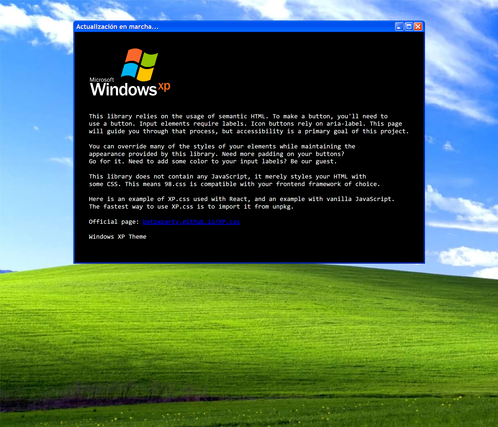

# Playing with XP.css

## A design system for building faithful recreations of old UIs.

## Screenshot

## Links

- Official page: [botoxparty.github.io/XP.css](https://botoxparty.github.io/XP.css/)
- Repo: [github.com/creativoma/windows-xp-css](https://github.com/creativoma/windows-xp-css)
- Deploy: [windows-xp-css.vercel.app](https://windows-xp-css.vercel.app)

## Author

- Github: [github.com/creativoma](https://github.com/creativoma)
- Linkedin: [linkedin.com/in/ma-marianoalvarez](https://www.linkedin.com/in/ma-marianoalvarez/)
